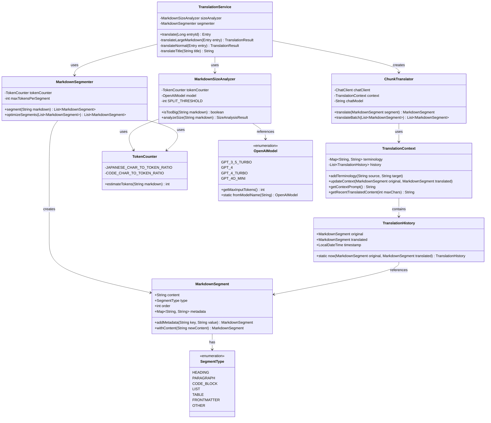

# 大規模マークダウン翻訳の実装詳細

> [!NOTE]
> このドキュメントは実装されたコードに基づいて更新されました

## 1. 概要と解決された課題

Translation APIは、OpenAI APIを使用してブログ記事のマークダウンを翻訳するシステムですが、以下の課題が解決されました：

- **入力サイズ制限の克服**: OpenAI APIの1リクエストあたりのトークン数制限に対応するための実装が完成しました
- **構造を保持した翻訳**: マークダウンの論理構造（見出し、段落、コードブロックなど）を認識し、適切に処理する仕組みが導入されました
- **コンテキスト連続性の確保**: 分割された翻訳間での文脈と一貫性を維持する機能が実装されました

実装された機能により、大規模な技術ブログ記事でも制限を超えることなく高品質な翻訳が可能になります。

## 2. アーキテクチャと主要コンポーネント

### 2.1 クラス構成の全体像

実装されたコンポーネントの関係は以下の通りです：



### 2.2 主要コンポーネントの役割

#### 2.2.1 TokenCounter

トークン数を推定するユーティリティクラスです。日本語のテキストとコードブロックで異なる文字/トークン比率を適用し、正確な推定を行います。

```java
public class TokenCounter {
    // 日本語テキストは文字あたり約0.7トークンと推定
    private static final double JAPANESE_CHAR_TO_TOKEN_RATIO = 0.7;
    
    // コードブロックは異なるトークン比率を持つ
    private static final double CODE_CHAR_TO_TOKEN_RATIO = 0.5;
    
    public int estimateTokens(String markdown) {
        // コードブロック内か判断するフラグ
        boolean inCodeBlock = false;
        int totalEstimatedTokens = 0;
        
        // 行ごとに処理
        String[] lines = markdown.split("\\n");
        for (String line : lines) {
            // コードブロックの開始/終了を検出
            if (line.trim().startsWith("```")) {
                inCodeBlock = !inCodeBlock;
            }
            
            // コンテンツタイプに応じた比率を適用
            double ratio = inCodeBlock ? CODE_CHAR_TO_TOKEN_RATIO : JAPANESE_CHAR_TO_TOKEN_RATIO;
            totalEstimatedTokens += line.length() * ratio;
        }
        
        // 安全係数を追加
        return (int) (totalEstimatedTokens * 1.1);
    }
}
```

#### 2.2.2 OpenAIModel

各OpenAIモデルのトークン制限を定義します。入力トークン数の上限を計算し、モデル名から適切なモデルを選択する機能があります。

```java
public enum OpenAIModel {
    GPT_3_5_TURBO("gpt-3.5-turbo", 4096),
    GPT_4("gpt-4", 8192),
    GPT_4_TURBO("gpt-4-turbo", 128000),
    GPT_4O_MINI("gpt-4o-mini", 16000); // デフォルトモデル
    
    // 実際に使用可能なトークン数を計算（応答のためのスペースを確保）
    public int getMaxInputTokens() {
        return (int) (maxTokens * 0.7); // 30%を応答用に確保
    }
    
    // モデル名から適切なOpenAIModelを取得
    public static OpenAIModel fromModelName(String modelName) {
        for (OpenAIModel model : values()) {
            if (model.getModelName().equals(modelName)) {
                return model;
            }
        }
        return GPT_4O_MINI; // デフォルトモデル
    }
}
```

#### 2.2.3 MarkdownSizeAnalyzer

マークダウンサイズを分析し、分割が必要かどうかを判断します。モデルの最大トークン数に基づいて閾値を設定します。

```java
public class MarkdownSizeAnalyzer {
    private final TokenCounter tokenCounter;
    private final OpenAIModel model;
    private final int SPLIT_THRESHOLD;
    
    public MarkdownSizeAnalyzer(OpenAIModel model) {
        this.tokenCounter = new TokenCounter();
        this.model = model;
        // マージンを確保して分割閾値を設定
        this.SPLIT_THRESHOLD = model.getMaxInputTokens() - 500;
    }
    
    public boolean isTooBig(String markdown) {
        int estimatedTokens = tokenCounter.estimateTokens(markdown);
        return estimatedTokens > SPLIT_THRESHOLD;
    }
    
    public SizeAnalysisResult analyzeSize(String markdown) {
        int estimatedTokens = tokenCounter.estimateTokens(markdown);
        boolean needsSplit = estimatedTokens > SPLIT_THRESHOLD;
        double usagePercentage = (double) estimatedTokens / model.getMaxInputTokens() * 100;
        
        return new SizeAnalysisResult(
            estimatedTokens,
            model.getMaxInputTokens(),
            needsSplit,
            usagePercentage
        );
    }
    
    // 分析結果を格納するレコード
    public record SizeAnalysisResult(
        int estimatedTokens,
        int maxAllowedTokens,
        boolean needsSplit,
        double usagePercentage
    ) {}
}
```

#### 2.2.4 MarkdownSegment

マークダウンのセグメントを表現するレコードクラスです。セグメントのコンテンツ、タイプ、順序、メタデータを保持します。

```java
public record MarkdownSegment(
    String content,
    SegmentType type,
    int order,
    Map<String, String> metadata
) {
    // メタデータなしのコンストラクタ
    public MarkdownSegment(String content, SegmentType type, int order) {
        this(content, type, order, new HashMap<>());
    }
    
    // メタデータを追加するメソッド
    public MarkdownSegment addMetadata(String key, String value) {
        Map<String, String> newMetadata = new HashMap<>(this.metadata);
        newMetadata.put(key, value);
        return new MarkdownSegment(this.content, this.type, this.order, newMetadata);
    }
    
    // 新しいコンテンツで更新されたセグメントを作成
    public MarkdownSegment withContent(String newContent) {
        return new MarkdownSegment(newContent, this.type, this.order, this.metadata);
    }
}
```

#### 2.2.5 MarkdownSegmenter

マークダウンを論理的なセグメントに分割するクラスです。各行のタイプを検出し、適切なセグメントにグループ化します。

```java
public class MarkdownSegmenter {
    private final TokenCounter tokenCounter;
    private final int maxTokensPerSegment;
    
    // セグメント検出用の正規表現パターン
    private static final Pattern HEADING_PATTERN = Pattern.compile("^(#{1,6})\\s+(.+)$");
    private static final Pattern FRONTMATTER_PATTERN = Pattern.compile("^---\\s*$");
    private static final Pattern CODE_BLOCK_START_PATTERN = Pattern.compile("^```.*$");
    private static final Pattern CODE_BLOCK_END_PATTERN = Pattern.compile("^```\\s*$");
    private static final Pattern LIST_PATTERN = Pattern.compile("^[\\s]*[\\*\\-\\+]\\s+.*$");
    private static final Pattern TABLE_PATTERN = Pattern.compile("^\\s*\\|.*\\|\\s*$");
    
    public MarkdownSegmenter() {
        this(4000); // デフォルトの最大トークン数
    }
    
    public MarkdownSegmenter(int maxTokensPerSegment) {
        this.tokenCounter = new TokenCounter();
        this.maxTokensPerSegment = maxTokensPerSegment;
    }
    
    public List<MarkdownSegment> segment(String markdown) {
        List<MarkdownSegment> segments = new ArrayList<>();
        String[] lines = markdown.split("\\n");
        
        StringBuilder currentSegment = new StringBuilder();
        SegmentType currentType = null;
        boolean inCodeBlock = false;
        boolean inFrontMatter = false;
        int segmentOrder = 0;
        
        // 行ごとにマークダウンを処理
        for (int i = 0; i < lines.length; i++) {
            String line = lines[i];
            
            // フロントマター処理
            if (FRONTMATTER_PATTERN.matcher(line.trim()).matches()) {
                if (!inFrontMatter && i == 0) {
                    // フロントマター開始
                    inFrontMatter = true;
                    currentType = SegmentType.FRONTMATTER;
                    currentSegment.append(line).append("\n");
                } else if (inFrontMatter) {
                    // フロントマター終了
                    inFrontMatter = false;
                    currentSegment.append(line).append("\n");
                    segments.add(new MarkdownSegment(currentSegment.toString(), SegmentType.FRONTMATTER, segmentOrder++));
                    currentSegment = new StringBuilder();
                    currentType = null;
                }
                continue;
            }
            
            // フロントマター内部の処理
            if (inFrontMatter) {
                currentSegment.append(line).append("\n");
                continue;
            }
            
            // コードブロック処理
            if (CODE_BLOCK_START_PATTERN.matcher(line.trim()).matches() && !inCodeBlock) {
                // コードブロック開始
                if (currentType != null && currentSegment.length() > 0) {
                    segments.add(new MarkdownSegment(currentSegment.toString(), currentType, segmentOrder++));
                    currentSegment = new StringBuilder();
                }
                inCodeBlock = true;
                currentType = SegmentType.CODE_BLOCK;
                currentSegment.append(line).append("\n");
                continue;
            }
            
            if (CODE_BLOCK_END_PATTERN.matcher(line.trim()).matches() && inCodeBlock) {
                // コードブロック終了
                currentSegment.append(line).append("\n");
                segments.add(new MarkdownSegment(currentSegment.toString(), SegmentType.CODE_BLOCK, segmentOrder++));
                currentSegment = new StringBuilder();
                currentType = null;
                inCodeBlock = false;
                continue;
            }
            
            if (inCodeBlock) {
                // コードブロック内部の処理
                currentSegment.append(line).append("\n");
                continue;
            }
            
            // 見出し処理
            if (HEADING_PATTERN.matcher(line.trim()).matches()) {
                if (currentType != null && currentSegment.length() > 0) {
                    segments.add(new MarkdownSegment(currentSegment.toString(), currentType, segmentOrder++));
                    currentSegment = new StringBuilder();
                }
                currentType = SegmentType.HEADING;
                currentSegment.append(line).append("\n");
                continue;
            }
            
            // その他の要素処理
            if (isNewSegmentNeeded(line, currentType)) {
                if (currentType != null && currentSegment.length() > 0) {
                    segments.add(new MarkdownSegment(currentSegment.toString(), currentType, segmentOrder++));
                    currentSegment = new StringBuilder();
                }
                currentType = detectSegmentType(line);
                currentSegment.append(line).append("\n");
            } else {
                // 現在のセグメントに追加
                if (currentType == null) {
                    currentType = detectSegmentType(line);
                }
                currentSegment.append(line).append("\n");
                
                // セグメントサイズチェック
                int currentTokenCount = tokenCounter.estimateTokens(currentSegment.toString());
                if (currentTokenCount > maxTokensPerSegment && currentType != SegmentType.CODE_BLOCK) {
                    segments.add(new MarkdownSegment(currentSegment.toString(), currentType, segmentOrder++));
                    currentSegment = new StringBuilder();
                    currentType = null;
                }
            }
        }
        
        // 最後のセグメントを追加
        if (currentSegment.length() > 0) {
            segments.add(new MarkdownSegment(currentSegment.toString(), 
                                      currentType != null ? currentType : SegmentType.PARAGRAPH, 
                                      segmentOrder));
        }
        
        return segments;
    }
    
    // その他のヘルパーメソッド（segment typeの検出など）
    // ...
    
    // 最適化機能 - 小さなセグメントをまとめる
    public List<MarkdownSegment> optimizeSegments(List<MarkdownSegment> segments) {
        if (segments == null || segments.size() <= 1) {
            return segments;
        }
        
        List<MarkdownSegment> optimized = new ArrayList<>();
        MarkdownSegment current = segments.get(0);
        StringBuilder content = new StringBuilder(current.content());
        
        for (int i = 1; i < segments.size(); i++) {
            MarkdownSegment next = segments.get(i);
            
            // セグメントを結合できるかチェック
            boolean sameType = current.type() == next.type();
            boolean notSpecialType = current.type() != SegmentType.CODE_BLOCK 
                                   && current.type() != SegmentType.HEADING
                                   && current.type() != SegmentType.FRONTMATTER;
            
            if (sameType && notSpecialType) {
                // マージして最大トークン数を超えないか確認
                String potentialMerge = content.toString() + next.content();
                if (tokenCounter.estimateTokens(potentialMerge) <= maxTokensPerSegment) {
                    // セグメント結合
                    content.append(next.content());
                    continue;
                }
            }
            
            // 結合できない場合、現在のセグメントを追加して次へ
            optimized.add(new MarkdownSegment(content.toString(), current.type(), current.order()));
            current = next;
            content = new StringBuilder(current.content());
        }
        
        // 最後のセグメントを追加
        optimized.add(new MarkdownSegment(content.toString(), current.type(), current.order()));
        
        return optimized;
    }
}
```

#### 2.2.6 TranslationContext と TranslationHistory

翻訳のコンテキスト（用語集や翻訳履歴）を管理するクラスです。チャンク間で一貫性のある翻訳を維持するために使用されます。

```java
public class TranslationContext {
    private final Map<String, String> terminology;
    private final List<TranslationHistory> history;
    private static final int MAX_CONTEXT_HISTORY = 3;
    
    public TranslationContext() {
        this.terminology = new HashMap<>();
        this.history = new ArrayList<>();
    }
    
    // 用語集に用語を追加
    public void addTerminology(String source, String target) {
        terminology.put(source, target);
    }
    
    // コンテキストに新しい翻訳履歴を追加
    public void updateContext(MarkdownSegment original, MarkdownSegment translated) {
        TranslationHistory entry = TranslationHistory.now(original, translated);
        history.add(entry);
        
        // 最新の履歴だけを保持
        if (history.size() > MAX_CONTEXT_HISTORY) {
            history.remove(0);
        }
    }
    
    // プロンプトで使用するコンテキスト情報を取得
    public String getContextPrompt() {
        StringBuilder contextPrompt = new StringBuilder();
        
        // 用語集があれば追加
        if (!terminology.isEmpty()) {
            contextPrompt.append("# Translation Terminology\n");
            terminology.forEach((source, target) -> 
                contextPrompt.append("- ").append(source).append(" → ").append(target).append("\n"));
            contextPrompt.append("\n");
        }
        
        // 翻訳履歴があれば追加
        if (!history.isEmpty()) {
            contextPrompt.append("# Previous Translations\n");
            List<TranslationHistory> recentHistory = history.subList(
                Math.max(0, history.size() - MAX_CONTEXT_HISTORY), 
                history.size()
            );
            
            for (TranslationHistory entry : recentHistory) {
                // 見出しの場合、コンテキストとして含める
                if (entry.original().type() == SegmentType.HEADING) {
                    contextPrompt.append("Section: ").append(entry.original().content().trim())
                               .append(" → ").append(entry.translated().content().trim())
                               .append("\n");
                }
            }
            
            contextPrompt.append("\n");
        }
        
        return contextPrompt.toString();
    }
    
    // 最近の翻訳コンテンツを取得（コンテキストとして使用）
    public String getRecentTranslatedContent(int maxChars) {
        // 実装略
    }
}

public record TranslationHistory(
    MarkdownSegment original,
    MarkdownSegment translated,
    LocalDateTime timestamp
) {
    // 現在の時間でTranslationHistoryを作成する便利メソッド
    public static TranslationHistory now(MarkdownSegment original, MarkdownSegment translated) {
        return new TranslationHistory(original, translated, LocalDateTime.now());
    }
}
```

#### 2.2.7 ChunkTranslator

マークダウンセグメントの翻訳を担当するクラスです。コンテキスト情報を利用して一貫性のある翻訳を行います。

```java
public class ChunkTranslator {
    private final ChatClient chatClient;
    private final TranslationContext context;
    private final String chatModel;
    private final Logger logger = LoggerFactory.getLogger(ChunkTranslator.class);
    
    public ChunkTranslator(ChatClient chatClient, String chatModel) {
        this.chatClient = chatClient;
        this.context = new TranslationContext();
        this.chatModel = chatModel;
    }
    
    // 単一セグメントの翻訳
    public MarkdownSegment translate(MarkdownSegment segment) {
        // コードブロックやフロントマターは翻訳しない
        if (segment.type() == SegmentType.CODE_BLOCK || segment.type() == SegmentType.FRONTMATTER) {
            return segment;
        }
        
        // プロンプト構築
        String prompt = buildPrompt(segment);
        
        try {
            String translatedText = this.chatClient.prompt()
                .user(prompt)
                .call()
                .content();
            
            String processedText = processTranslation(translatedText);
            MarkdownSegment translatedSegment = segment.withContent(processedText);
            
            // コンテキスト更新
            context.updateContext(segment, translatedSegment);
            
            return translatedSegment;
        } catch (Exception e) {
            logger.error("Error translating segment: {}", e.getMessage());
            // エラー時は原文を返す
            return segment;
        }
    }
    
    // セグメントのバッチ翻訳
    public List<MarkdownSegment> translateBatch(List<MarkdownSegment> segments) {
        List<MarkdownSegment> translatedSegments = new ArrayList<>();
        
        for (MarkdownSegment segment : segments) {
            MarkdownSegment translatedSegment = translate(segment);
            translatedSegments.add(translatedSegment);
        }
        
        return translatedSegments;
    }
    
    // 翻訳プロンプトの構築
    private String buildPrompt(MarkdownSegment segment) {
        String segmentTypeDesc = getSegmentTypeDescription(segment.type());
        String contextPrompt = context.getContextPrompt();
        
        return """
            # Translation Context
            %s
            # Translation Instructions
            Please translate the following Japanese markdown text to English.
            Preserve code blocks and HTML elements in the markdown without translating them.
            Translate the %s section.
            Do not include any explanations, just translate the text directly.
            
            # Input Text
            %s
            
            # Output Format
            Return only the translation result in markdown format.
            """.formatted(contextPrompt, segmentTypeDesc, segment.content());
    }
    
    // セグメントタイプの説明
    private String getSegmentTypeDescription(SegmentType type) {
        return switch (type) {
            case HEADING -> "heading";
            case PARAGRAPH -> "paragraph";
            case LIST -> "list";
            case TABLE -> "table";
            case CODE_BLOCK -> "code block";
            case FRONTMATTER -> "frontmatter";
            default -> "content";
        };
    }
    
    // 翻訳結果の後処理
    private String processTranslation(String rawTranslation) {
        // 実装略
    }
}
```

### 2.3 TranslationServiceの拡張

既存のTranslationServiceクラスを拡張し、大規模マークダウンの処理に対応しました。

```java
@Service
public class TranslationService {
    // 既存のフィールド
    private final RestClient restClient;
    private final GithubProps githubProps;
    private final EntryProps entryProps;
    private final ChatClient chatClient;
    private final String chatModel;
    private final Logger logger = LoggerFactory.getLogger(TranslationService.class);
    
    // 新しいフィールド
    private final MarkdownSizeAnalyzer sizeAnalyzer;
    private final MarkdownSegmenter segmenter;
    
    public TranslationService(/* 既存のパラメータ */) {
        // 既存の初期化
        
        // マークダウン処理コンポーネント初期化
        OpenAIModel model = OpenAIModel.fromModelName(chatModel);
        this.sizeAnalyzer = new MarkdownSizeAnalyzer(model);
        this.segmenter = new MarkdownSegmenter();
    }
    
    public Entry translate(Long entryId) {
        Entry entry = /* APIからエントリを取得 */;
        
        // マークダウンサイズ分析
        String content = entry.content();
        MarkdownSizeAnalyzer.SizeAnalysisResult sizeResult = sizeAnalyzer.analyzeSize(content);
        
        String translatedContent;
        String translatedTitle;
        
        if (sizeResult.needsSplit()) {
            // 大規模マークダウンの場合、チャンク処理
            logger.info("Large markdown detected ({}% of limit). Processing with chunking...", 
                    String.format("%.2f", sizeResult.usagePercentage()));
            TranslationResult result = translateLargeMarkdown(entry);
            translatedContent = result.content();
            translatedTitle = result.title();
        } else {
            // 通常の翻訳処理
            TranslationResult result = translateNormal(entry);
            translatedContent = result.content();
            translatedTitle = result.title();
        }
        
        // 翻訳結果で新しいEntryを作成
        return EntryBuilder.from(entry)
            .content(
                    """
                    > ⚠️ This article was automatically translated by OpenAI (%s).
                    > It may be edited eventually, but please be aware that it may contain incorrect information at this time.

                    """.formatted(this.chatModel) + translatedContent)
            .frontMatter(FrontMatterBuilder.from(entry.frontMatter()).title(translatedTitle).build())
            .build();
    }
    
    /**
     * 大規模マークダウンをチャンクに分けて翻訳
     */
    private TranslationResult translateLargeMarkdown(Entry entry) {
        // ステップ1: マークダウンをセグメントに分割
        List<MarkdownSegment> segments = segmenter.segment(entry.content());
        logger.info("Segmented markdown into {} chunks", segments.size());
        
        // ステップ2: チャンク翻訳用のトランスレータを作成
        ChunkTranslator translator = new ChunkTranslator(this.chatClient, this.chatModel);
        
        // ステップ3: 各セグメントを翻訳
        List<MarkdownSegment> translatedSegments = translator.translateBatch(segments);
        
        // ステップ4: 翻訳結果を結合
        String translatedContent = translatedSegments.stream()
                .map(MarkdownSegment::content)
                .collect(Collectors.joining("\n"));
        
        // ステップ5: タイトルを翻訳
        String translatedTitle = translateTitle(entry.frontMatter().title());
        
        return new TranslationResult(translatedTitle, translatedContent);
    }
    
    /**
     * 通常の翻訳処理（1リクエストで処理可能なマークダウン向け）
     */
    private TranslationResult translateNormal(Entry entry) {
        String text = this.chatClient.prompt()
            .user(u -> u
                .text("""
                    Please translate the following Japanese blog entry into English. Both title and content are to be translated.
                    The content is written in markdown.
                    Please include the <code>and <pre> elements in the markdown content in the result without translating them.
                    The part surrounded by ```` in markdown is the source code, so please do not translate the Japanese in that code.
                    The format of the input and the output should be following format and do not include any explanations.

                    == title ==
                    translated title

                    == content ==
                    translated content (markdown)

                    The input entry is the following:

                    == title ==
                    {title}

                    == content ==
                    {content}
                    """)
                .param("title", entry.frontMatter().title())
                .param("content", entry.content()))
            .call()
            .content();
        ResponseParser.TitleAndContent titleAndContent = ResponseParser.parseText(Objects.requireNonNull(text));
        return new TranslationResult(titleAndContent.title(), titleAndContent.content());
    }
    
    /**
     * タイトルのみの翻訳
     */
    private String translateTitle(String title) {
        String text = this.chatClient.prompt()
            .user("""
                Please translate the following Japanese blog title into English:
                
                %s
                
                Return only the translated title with no additional text or formatting.
                """.formatted(title))
            .call()
            .content();
        
        return text != null ? text.trim() : "";
    }
    
    /**
     * 翻訳結果を保持するレコード
     */
    private record TranslationResult(String title, String content) {}
}
```

## 3. 実装の詳細と最適化

### 3.1 マークダウンセグメンテーション戦略

マークダウンの分割は以下の戦略に基づいて実装されています：

1. **構造認識アプローチ**: マークダウンの構造（見出し、段落、コードブロックなど）を認識し、論理的な単位で分割します。
2. **チャンク結合の最適化**: 小さなセグメントは可能な限り結合し、APIリクエスト数を最小化します。
3. **特殊要素の保護**: コードブロックやフロントマターなどの特殊要素は翻訳されず、そのまま保持されます。
4. **トークン制限の遵守**: 各セグメントが指定されたトークン制限を超えないよう調整されます。

セグメンテーションのアルゴリズムは、特に以下のパターンに注意します：

- **見出し**: 常に新しいセグメントの開始点として扱います
- **コードブロック**: 完全なブロックを単一のセグメントとして保持します
- **フロントマター**: YAMLフロントマターを特定して保護します
- **リストと表**: リストや表は可能な限り単一のセグメントとして保持します

### 3.2 コンテキスト連続性の維持

翻訳の一貫性を確保するために以下の手法を実装しています：

1. **用語集**: 重要な用語とその翻訳を管理し、複数のセグメントで一貫した翻訳を確保します。
2. **翻訳履歴**: 直前に翻訳されたセグメント（特に見出し）を記録し、コンテキスト情報として使用します。
3. **プロンプト設計**: 各セグメントの翻訳に際して、セグメントの種類とコンテキストが提供されます。

コンテキストを含むプロンプトの例：

```
# Translation Context
Section: # Spring Boot入門 → # Introduction to Spring Boot

# Translation Instructions
Please translate the following Japanese markdown text to English.
Preserve code blocks and HTML elements in the markdown without translating them.
Translate the paragraph section.
Do not include any explanations, just translate the text directly.

# Input Text
Spring Bootは、Javaベースのアプリケーション開発を簡素化するフレームワークです。

# Output Format
Return only the translation result in markdown format.
```

### 3.3 パフォーマンス最適化

以下のパフォーマンス最適化を実装しています：

1. **適応的処理**: 小さなマークダウンは単一リクエストで処理し、大きなマークダウンのみチャンキングを使用します。
2. **適切なトークン推定**: 日本語とコードでは異なるトークン比率を適用し、より正確な分割を実現します。
3. **セグメント最適化**: 小さなセグメントを結合して、APIリクエスト数を削減します。
4. **エラー回復**: 個別のセグメント翻訳で失敗した場合でも、全体の処理は続行されます。

## 4. テストと検証

実装されたコードは、以下のユニットテストを通じて検証されています：

1. **TokenCounterTest**: トークン推定の正確性をテスト
2. **MarkdownSegmenterTest**: マークダウン分割の正確性をテスト
3. **MarkdownSizeAnalyzerTest**: サイズ分析の正確性をテスト
4. **TranslationContextTest**: コンテキスト管理機能をテスト
5. **OpenAIModelTest**: モデル情報の正確性をテスト

テストは様々なマークダウン構造と特殊ケース（コードブロック、フロントマターなど）をカバーし、実装の堅牢性を確保しています。

## 5. 今後の展望

この実装の次のステップとして以下の拡張が考えられます：

1. **並列処理の強化**: 独立したチャンクの同時翻訳によるパフォーマンス向上
2. **適応的なモデル選択**: コンテンツの複雑さに基づいて最適なAIモデルを選択
3. **翻訳メモリ**: 過去の翻訳結果をキャッシュし、同一または類似のコンテンツの再翻訳を回避
4. **ユーザーフィードバックの統合**: 翻訳結果への修正をコンテキストに取り込み、将来の翻訳品質を向上

## 6. まとめ

大規模マークダウン翻訳の実装により、以下の改善が実現されました：

1. **サイズ制限の克服**: OpenAI APIのトークン制限に関係なく、任意のサイズのマークダウンを処理可能になりました。
2. **高い一貫性**: チャンク間でコンテキストを維持することで、一貫した高品質な翻訳を実現しています。
3. **構造保全**: マークダウンの論理構造を尊重し、コードブロックやフロントマターなどの特殊要素を適切に処理します。
4. **拡張性**: モジュラー設計により、将来の要件変更や機能拡張に容易に対応できます。

この実装は、技術ブログの翻訳という特定のユースケースに最適化されていますが、そのアプローチは他の構造化テキスト翻訳にも応用可能です。
