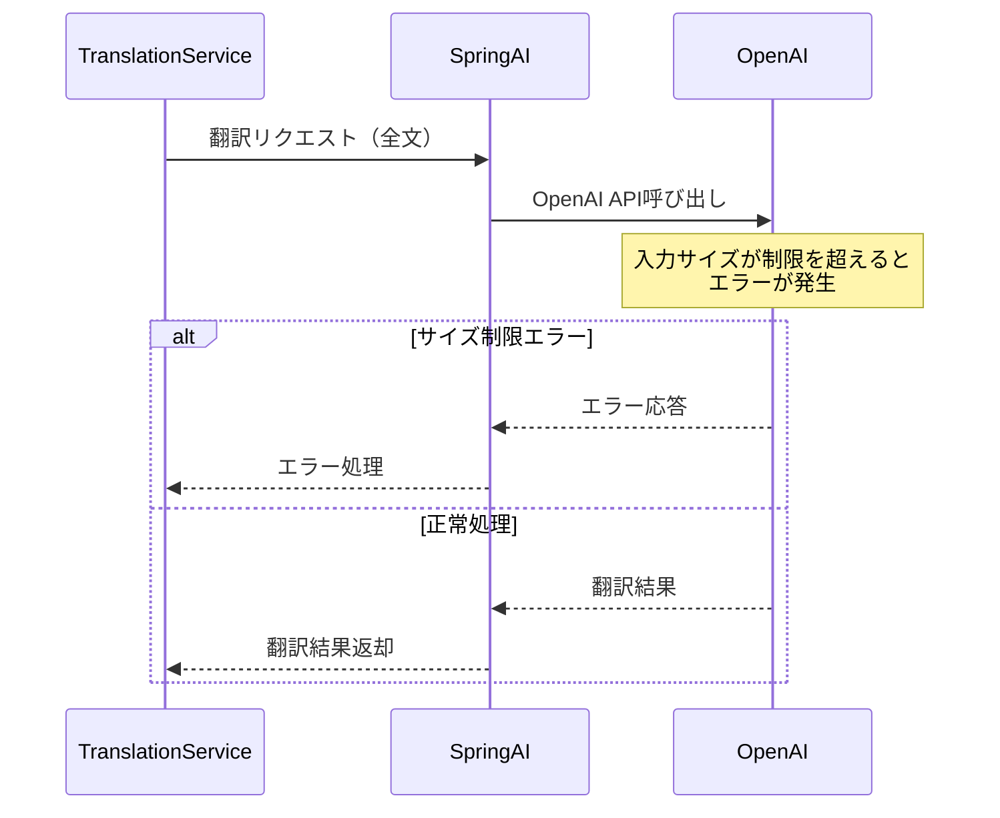
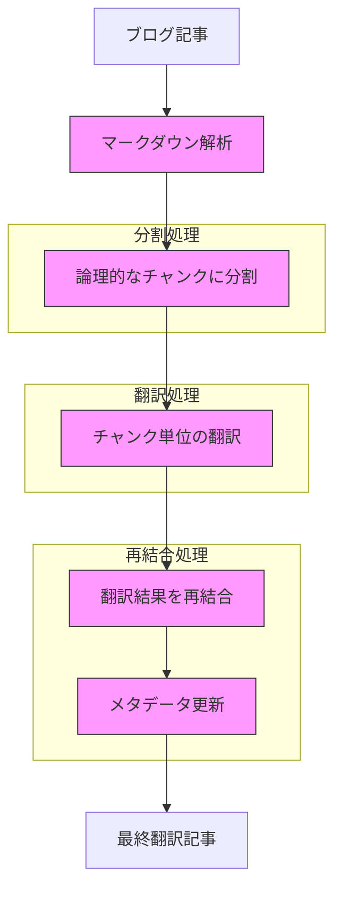
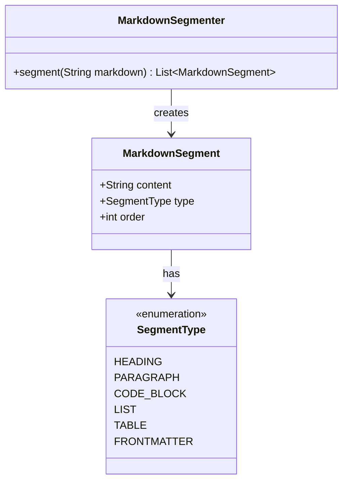
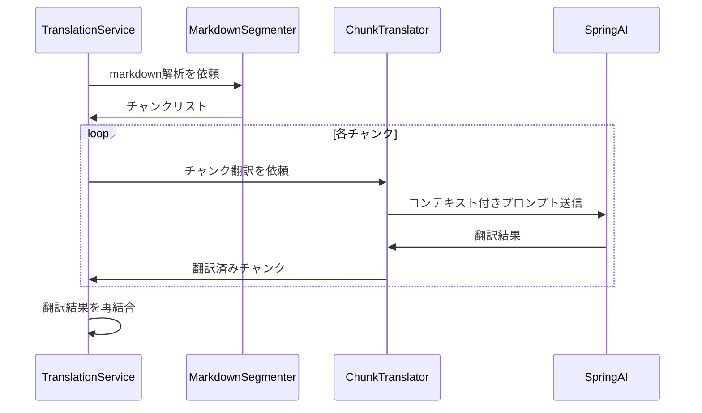
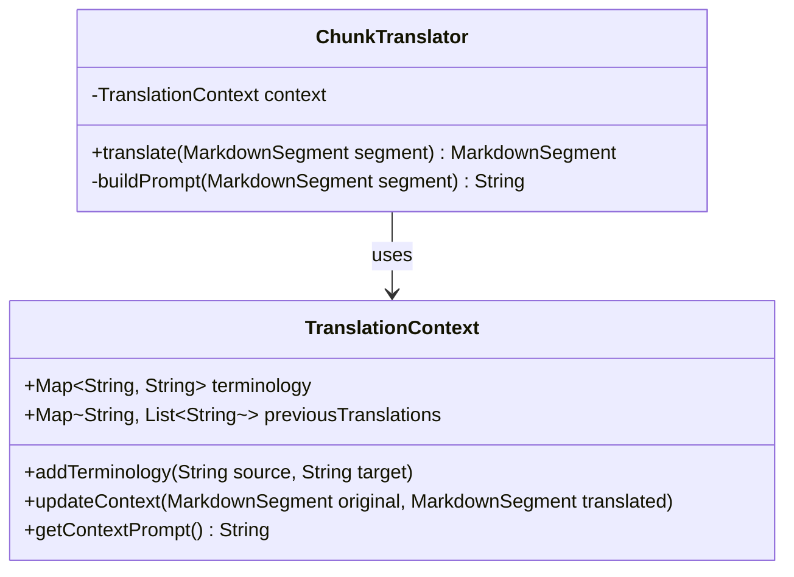
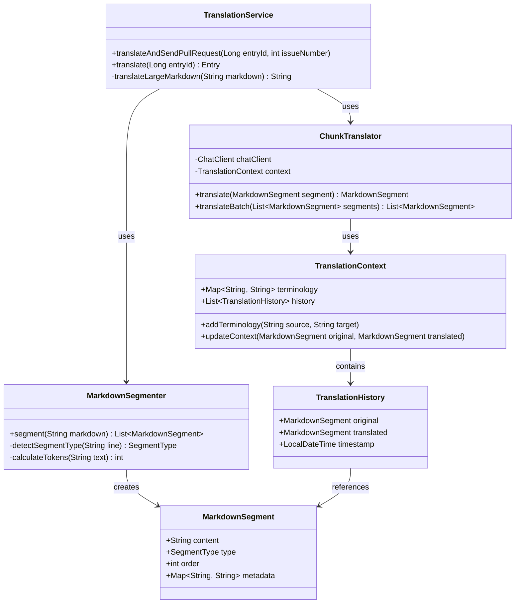
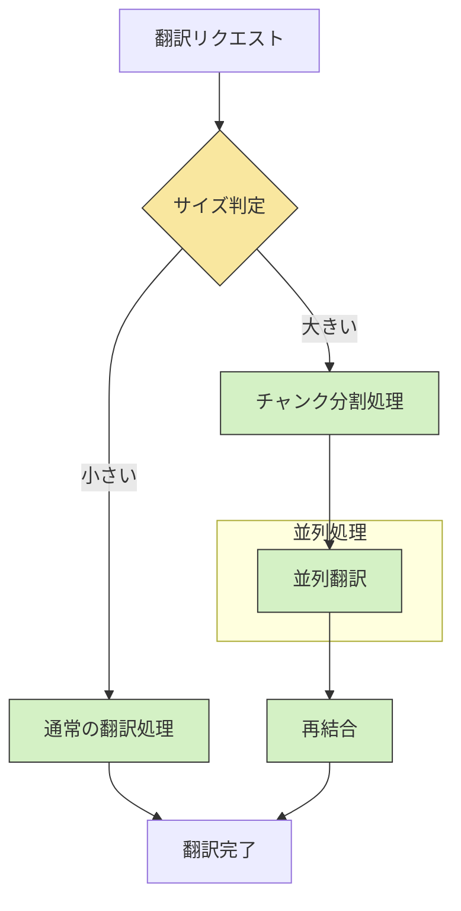
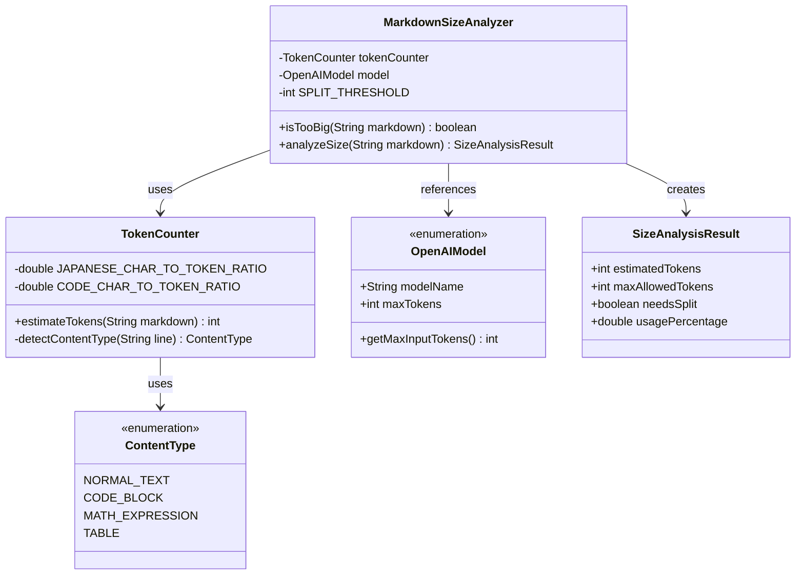

# 大規模マークダウン翻訳の改善提案

> [!NOTE] 
> このドキュメントはAIによって生成されました

## 1. 現状の課題

Translation APIでは、ブログ記事のマークダウンを翻訳する際にOpenAI APIを利用していますが、以下の問題が発生しています：

- **入力サイズ制限**: OpenAI APIには1リクエストあたりの入力トークン数に制限があります（モデルによって異なる）
- **大規模マークダウン**: 長文の技術ブログ記事では、コードブロックや画像リンク等を含め、制限を超えるサイズになることがある
- **コンテキスト分断**: 単純に記事を分割すると、文脈が失われ、翻訳品質が低下する可能性がある

現在のフローでは、翻訳処理が以下のように実行されています：



## 2. 改善案

### 2.1 チャンク分割と再結合アプローチ

大規模マークダウンを適切に分割し、翻訳後に再結合する方式を提案します。



### 2.2 具体的な実装方法

#### 2.2.1 マークダウン解析と分割

マークダウンを構造的に解析し、論理的なチャンクへの分割を行います：



分割アルゴリズムの具体的なステップ：

1. **ヘッダーレベルによる分割**: `# h1`, `## h2` などのヘッダーで基本チャンクを定義
2. **コードブロックの保護**: コードブロック (```` ```code```` など) を独立したセグメントとして抽出
3. **論理的なグループ化**: 関連するパラグラフや箇条書きをヘッダーに基づいてグループ化
4. **サイズ管理**: 各チャンクがモデルの最大許容トークン数を超えないよう調整
5. **コンテキスト保持**: チャンク間の文脈を維持するために必要な情報を付加

#### 2.2.2 翻訳処理の拡張

翻訳処理はチャンク単位で実行し、コンテキストを維持します：



#### 2.2.3 コンテキスト管理クラス

翻訳の一貫性を保つためのコンテキスト管理クラスを新設します：



### 2.3 プロンプトエンジニアリング

チャンク単位の翻訳を効果的に行うための特殊なプロンプト構造：

```
# Translation Context
Previously translated terminology:
${terminology}

Content from previous section:
${previousContext}

# Translation Instructions
Please translate the following Japanese markdown text to English.
Preserve code blocks and HTML elements in the markdown without translating them.
Translate the ${chunkType} section.

# Input Text
${inputChunk}

# Output Format
Return only the translation result in markdown format.
```

## 3. 実装計画

### 3.1 新規クラス構成



### 3.2 実装ステップ

1. **マークダウンセグメンターの実装**：マークダウンを解析し、適切なチャンクに分割するクラスを作成
2. **翻訳コンテキスト管理の実装**：チャンク間での用語一貫性を保持する仕組みを構築
3. **チャンク翻訳クラスの実装**：コンテキスト付きの翻訳処理を行うクラスを作成
4. **再結合ロジックの実装**：翻訳したチャンクを元の構造に合わせて再結合する処理
5. **エラーハンドリングの強化**：部分的な翻訳失敗時にもリカバリー可能な仕組み
6. **TranslationServiceの拡張**：大規模マークダウン処理に対応するよう既存サービスを拡張

## 4. パフォーマンス考慮事項



### 4.1 効果的なサイズ判定の実装

マークダウンのサイズを効果的に判定するための具体的な実装方法を示します。



#### トークン数の推定

OpenAI APIは入力を「トークン」単位で計測します。サイズ判定には正確なトークン数の推定が重要です：

```java
public class TokenCounter {
    // Estimate approximately 0.7 tokens per character for Japanese text
    private static final double JAPANESE_CHAR_TO_TOKEN_RATIO = 0.7;
    
    // Code blocks typically have different token ratio per character
    private static final double CODE_CHAR_TO_TOKEN_RATIO = 0.5;
    
    /**
     * Estimates token count for markdown text
     */
    public int estimateTokens(String markdown) {
        int totalEstimatedTokens = 0;
        boolean inCodeBlock = false;
        
        // Process line by line
        String[] lines = markdown.split("\n");
        for (String line : lines) {
            // Detect code block start/end
            if (line.trim().startsWith("```")) {
                inCodeBlock = !inCodeBlock;
            }
            
            // Apply appropriate ratio based on content type
            double ratio = inCodeBlock ? CODE_CHAR_TO_TOKEN_RATIO : JAPANESE_CHAR_TO_TOKEN_RATIO;
            totalEstimatedTokens += line.length() * ratio;
        }
        
        // Add safety factor
        return (int) (totalEstimatedTokens * 1.1);
    }
}
```

#### モデル別のトークン上限設定

GPT-4o-mini をデフォルトモデルとして使用します：

```java
public enum OpenAIModel {
    GPT_3_5_TURBO("gpt-3.5-turbo", 4096),
    GPT_4("gpt-4", 8192),
    GPT_4_TURBO("gpt-4-turbo", 128000),
    GPT_4O_MINI("gpt-4o-mini", 16000); // Default model
    
    private final String modelName;
    private final int maxTokens;
    
    // Calculate actual usable tokens, reserving space for response
    public int getMaxInputTokens() {
        return (int) (maxTokens * 0.7); // Reserve 30% for response
    }
    
    // Constructors and getters omitted
}
```

#### サイズ判定ロジック

```java
/**
 * Analyzes markdown size and determines if chunking is necessary
 */
public class MarkdownSizeAnalyzer {
    private final TokenCounter tokenCounter;
    private final OpenAIModel model;
    
    // Threshold for splitting (max input tokens minus margin)
    private final int SPLIT_THRESHOLD;
    
    public MarkdownSizeAnalyzer(OpenAIModel model) {
        this.tokenCounter = new TokenCounter();
        this.model = model;
        this.SPLIT_THRESHOLD = model.getMaxInputTokens() - 500; // 500 token margin
    }
    
    /**
     * Returns size analysis result for the given markdown
     */
    public SizeAnalysisResult analyzeSize(String markdown) {
        int estimatedTokens = tokenCounter.estimateTokens(markdown);
        boolean needsSplit = estimatedTokens > SPLIT_THRESHOLD;
        double usagePercentage = (double) estimatedTokens / model.getMaxInputTokens() * 100;
        
        return new SizeAnalysisResult(
            estimatedTokens,
            model.getMaxInputTokens(),
            needsSplit,
            usagePercentage
        );
    }
    
    /**
     * Record containing size analysis results
     */
    public record SizeAnalysisResult(
        int estimatedTokens,
        int maxAllowedTokens,
        boolean needsSplit,
        double usagePercentage
    ) {}
}
```

#### TranslationServiceでの統合例

```java
@Service
public class TranslationService {
    // Other fields omitted
    
    private final MarkdownSizeAnalyzer sizeAnalyzer;
    private final MarkdownSegmenter segmenter;
    private final ChunkTranslator chunkTranslator;
    
    public Entry translate(Long entryId) {
        Entry entry = // Fetch entry from Blog API
        
        // Analyze markdown size
        String content = entry.content();
        MarkdownSizeAnalyzer.SizeAnalysisResult sizeResult = 
            sizeAnalyzer.analyzeSize(content);
            
        String translatedContent;
        if (sizeResult.needsSplit()) {
            // Process large markdown with chunking
            translatedContent = translateLargeMarkdown(content);
            logger.info("Large markdown processed with chunks: {}% of limit", 
                       String.format("%.2f", sizeResult.usagePercentage()));
        } else {
            // Normal translation process
            translatedContent = translateNormal(content);
        }
        
        // Create new Entry with translation results
        // ...
    }
}
```

### 4.2 並列処理

- **独立したチャンクは並列翻訳**：相互依存のないチャンクは並行して処理
- **コンテキスト依存チャンクは逐次処理**：前のセクションの翻訳を参照必要なものは順次処理

### 4.2 キャッシング

- **翻訳結果のキャッシング**：同じパターンの翻訳要求に対する結果をキャッシュ
- **用語集の構築**：プロジェクト固有の用語対応表を蓄積・活用

## 5. テスト戦略

1. **様々なサイズのマークダウンでの検証**：小・中・大サイズの記事でテスト
2. **特殊要素を含むケース**：コードブロック、表、リスト等の特殊マークダウン要素を含む記事の処理確認
3. **エラー条件のテスト**：API制限エラー、部分的な翻訳失敗などの状況のハンドリングを検証

## 6. まとめ

大規模マークダウンの翻訳には、構造的な分割と文脈を維持した再結合が鍵となります。提案した改善策では：

1. **構造的な分割**：マークダウンの論理構造に基づくインテリジェントな分割
2. **コンテキスト維持**：チャンク間で文脈情報を伝播させる仕組み
3. **適応的処理**：文書サイズに応じて最適な処理方法を選択
4. **耐障害性**：部分的な翻訳失敗からのリカバリー機能

これにより、任意の大きさのマークダウン文書でも効率的かつ高品質な翻訳が可能になります。
