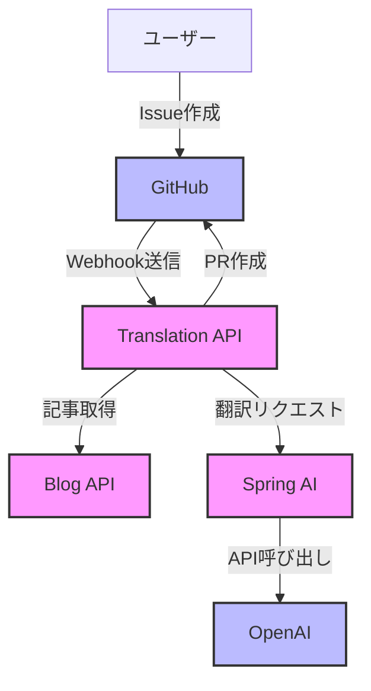
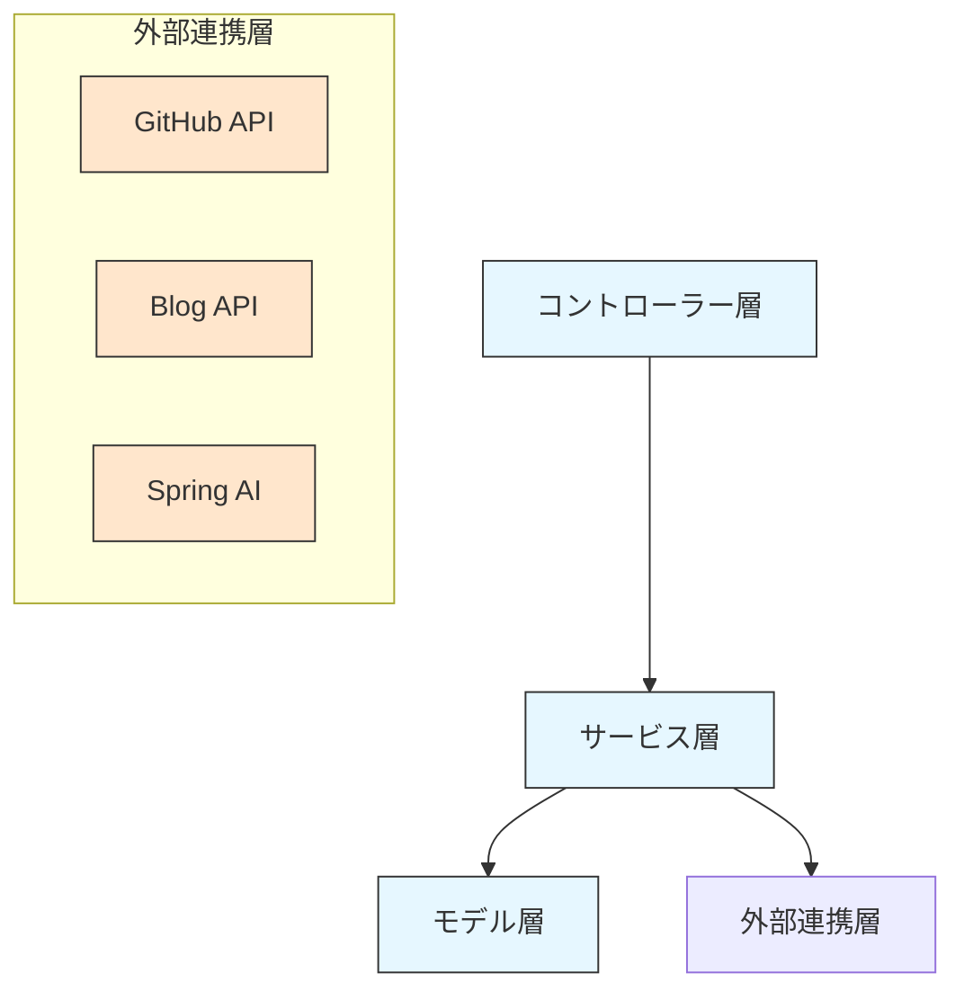
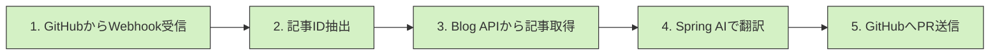
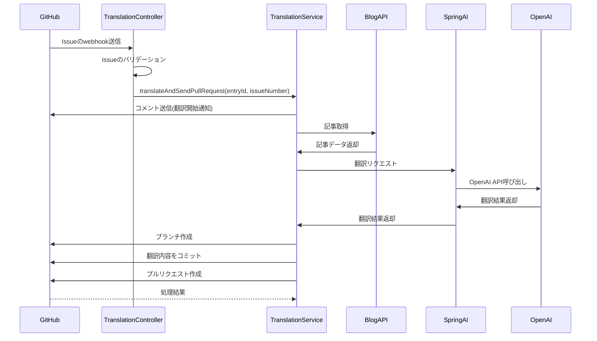
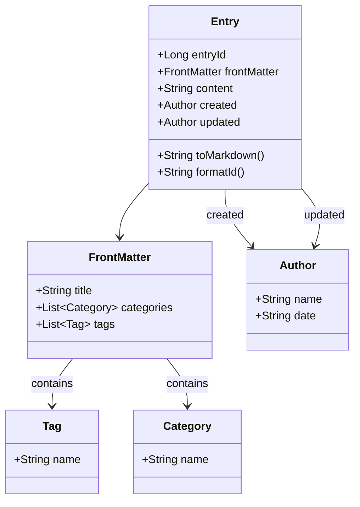
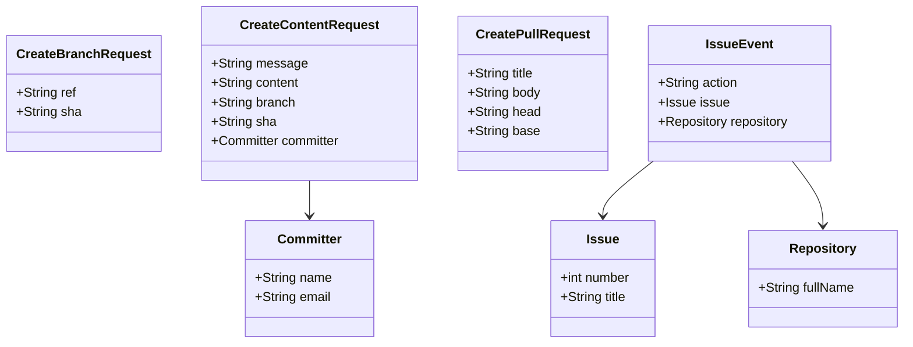
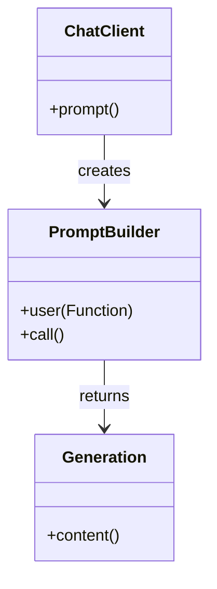
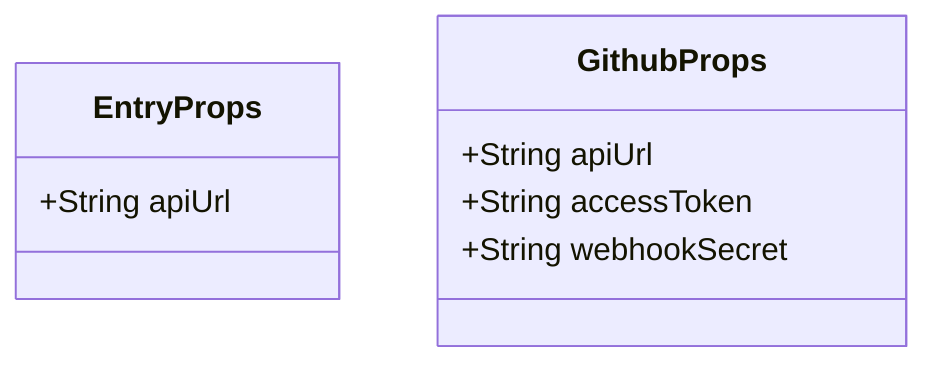
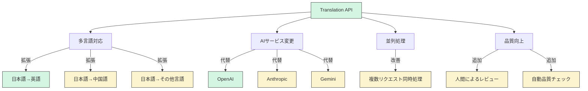

# Translation API 設計書

> [!NOTE]
> このドキュメントはAIによって生成されました

## 1. はじめに

本ドキュメントは、ブログ記事の自動翻訳を行うTranslation APIシステムの設計を解説します。このシステムはGitHubのIssueをトリガーとして、日本語のブログ記事を英語に翻訳し、その結果をプルリクエストとして送信する機能を提供します。

## 2. システム概要

### 2.1 システムの目的

このシステムは以下の目的で開発されています：

- GitHubのIssueをトリガーとしてブログ記事の翻訳を自動化する
- Spring AIを利用したOpenAIサービスで日本語から英語への高品質な翻訳を行う
- 翻訳結果をGitHubリポジトリへプルリクエストとして送信する

### 2.2 システムの全体像



システムは以下の主要なコンポーネントで構成されています：

1. **Translation API**: Spring Bootで構築されたRESTful APIサービス
2. **GitHub**: Issueの作成とプルリクエストの処理を行う
3. **Blog API**: 翻訳対象のブログ記事を提供するAPI
4. **Spring AI**: OpenAI APIを抽象化したSpringのライブラリ
5. **OpenAI**: 実際の翻訳処理を行うAIサービス

## 3. システムアーキテクチャ

### 3.1 レイヤー構造

システムは以下のようなレイヤー構造で構成されています：



- **コントローラー層**: HTTPリクエストを受け付け、サービス層へ処理を委譲
- **サービス層**: ビジネスロジックを実装
- **モデル層**: データモデルを定義
- **外部連携層**: GitHub API、Spring AI、Blog APIとの連携を担当

### 3.2 主要なコンポーネント

システムを構成する主要なコンポーネントは以下の通りです：

```
am.ik.translation
├── TranslationApiApplication.java    # アプリケーションのエントリーポイント
├── TranslationController.java        # Webhookを受信するコントローラー
├── TranslationService.java           # 翻訳処理のメインロジック
├── config/                           # 設定関連
├── entry/                            # ブログ記事のモデル
├── github/                           # GitHub連携用モデル
└── util/                             # ユーティリティクラス
```

## 4. 処理フロー

### 4.1 基本的な処理フロー



1. GitHubからIssueのWebhookを受信
2. Issueのタイトルからブログ記事のIDを抽出
3. Blog APIから対象の記事を取得
4. Spring AIを使用して翻訳
5. 翻訳結果をGitHubへプルリクエストとして送信

### 4.2 詳細な処理フロー

以下に、より詳細な処理フローを示します：



## 5. 主要なクラスと機能

### 5.1 TranslationController

GitHubから送信されるIssueのWebhookを受信し、処理を開始します。

```java
@RestController
public class TranslationController {
    // GitHubからのWebhook受信エンドポイント
    @PostMapping(path = "webhook", headers = "X-GitHub-Event=issues")
    public ResponseEntity<String> webhook(@WebhookPayload @RequestBody String payload) {
        // GitHubイベントの処理
    }
}
```

主な責務：
- GitHubからのWebhookリクエスト受信
- Issueの検証（タイトルパターンのマッチング）
- 翻訳処理の開始

### 5.2 TranslationService

翻訳処理の中心となるロジックを実装しています。

```java
@Service
public class TranslationService {
    private final ChatClient chatClient;
    private final String chatModel;
    
    // 非同期で翻訳処理とプルリクエスト送信を実行
    @Async
    public void translateAndSendPullRequest(Long entryId, int issueNumber) {
        // 翻訳処理の実行
    }
    
    // 実際の翻訳処理
    public Entry translate(Long entryId) {
        // Spring AIのChatClientを使用した翻訳処理
        String text = this.chatClient.prompt()
            .user(u -> u
                .text("""
                    Please translate the following Japanese blog entry into English...
                    """)
                .param("title", entry.frontMatter().title())
                .param("content", entry.content()))
            .call()
            .content();
    }
    
    // GitHub PRの作成
    public CreatePullResponse sendPullRequest(Entry translated, int issueNumber) {
        // GitHubへのプルリクエスト送信
    }
}
```

主な責務：
- Blog APIからの記事取得
- Spring AIのChatClientを使用した翻訳処理
- GitHubへのプルリクエスト送信
- 非同期処理の実行

### 5.3 Entry関連クラス

ブログ記事のデータモデルを定義します。



```java
@Builder(toBuilder = "from")
public record Entry(Long entryId, FrontMatter frontMatter, String content, 
                   Author created, Author updated) {
    // マークダウン形式に変換するメソッド
    public String toMarkdown() {
        // マークダウン形式への変換処理
    }
}
```

主な関連クラス：
- `FrontMatter`: 記事のメタデータ（タイトル、タグ、カテゴリ）
- `Author`: 記事の著者情報
- `Tag`: 記事のタグ情報
- `Category`: 記事のカテゴリ情報

### 5.4 GitHub関連クラス

GitHub APIとの連携に使用するモデルクラスです。



主な関連クラス：
- `CreateBranchRequest`: ブランチ作成リクエスト
- `CreateContentRequest`: コンテンツ作成リクエスト
- `CreatePullRequest`: プルリクエスト作成リクエスト
- `IssueEvent`: Issueイベント情報

### 5.5 Spring AI 連携

Spring AIはAIサービスとの連携を簡略化するSpringのライブラリです。このプロジェクトではOpenAI APIとの連携に使用されています。



Spring AIの主要コンポーネント：
- `ChatClient`: AIサービスとのやり取りを抽象化するクライアント
- `PromptBuilder`: プロンプトの構築を支援するビルダー
- `Generation`: 生成されたコンテンツを表すクラス

## 6. 設定

### 6.1 主要な設定項目

システムは以下の設定項目で構成されています：

```properties
# Blog API設定
entry.api-url=https://blog-api-blog.apps.ik.am

# GitHub API設定
github.api-url=https://api.github.com
github.access-token=<GitHub Personal Access Token>
github.webhook-secret=<Webhook Secret>

# Spring AI OpenAI設定
spring.ai.openai.api-key=<OpenAI API Key>
spring.ai.openai.base-url=https://api.openai.com
spring.ai.openai.chat.options.model=gpt-4o-mini
spring.ai.openai.chat.options.temperature=0
spring.ai.retry.on-http-codes=408,425,429,500,502,503,504
spring.ai.retry.max-attempts=1
```

### 6.2 設定クラス

設定値は以下のConfigurationPropertiesクラスで管理されています：



- `EntryProps`: Blog APIの設定
- `GithubProps`: GitHub APIの設定
- Spring AIの設定はSpring Bootの自動構成によって管理されています

## 7. 拡張性と今後の展望

このシステムは以下の点で拡張可能です：



1. **多言語対応**: 現在は日英翻訳のみですが、他の言語ペアにも拡張可能
2. **AIサービス変更**: Spring AIの抽象化により、他のAIプロバイダーへの切り替えが容易
3. **並列処理**: 複数の翻訳リクエストを同時に処理する能力の強化
4. **品質向上**: 翻訳結果の人間によるレビュープロセスの追加

## 8. まとめ

Translation APIは、Spring BootとSpring AIを活用して、GitHubのイベントをトリガーとしたブログ記事の自動翻訳システムを実現しています。Spring AIを活用することで特定のAIプロバイダーに依存せず、柔軟なアーキテクチャを実現しています。非同期処理を採用することで、長時間を要する翻訳処理をバックグラウンドで実行し、GitHubへの連携を効率的に行っています。

設定の柔軟性を確保しつつ、各コンポーネントの責務を明確に分離することで、保守性と拡張性の高いアーキテクチャとなっています。
